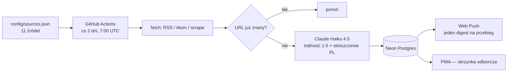

# DevPuls

[](https://github.com/Blazej90/devpuls/actions/workflows/ingest.yml)

Czytnik nowinek technicznych, który zamiast kolejnego feeda daje **skrzynkę odbiorczą**:
agent obchodzi 11 źródeł, ocenia każdy wpis pod kątem jednego konkretnego profilu
(TypeScript / React / JavaScript / fullstack / AI), streszcza po polsku i wysyła
**jedno zbiorcze powiadomienie** na przebieg — nie jedno na artykuł.

Na żywo: **[devpuls-ecru.vercel.app](https://devpuls-ecru.vercel.app/)** (PWA, instalowalna).

---

## Jak to działa



1. **Pobranie.** `packages/agent` czyta `config/sources.json` i ściąga każde źródło
   właściwym fetcherem (`rss`, `atom`, `scrape`). Wszystkie zwracają ten sam
   znormalizowany kształt, więc dalszy pipeline nie wie, skąd wpis przyszedł.
2. **Deduplikacja.** `items.url` ma `UNIQUE` — to on realizuje „już to widzieliśmy",
   a nie porównywanie tytułów. Usuwanie wpisu jest z tego samego powodu **miękkie**:
   po twardym `DELETE` artykuł wróciłby przy najbliższym przebiegu, z powiadomieniem.
3. **Ocena.** Jedno wywołanie Claude na nowy wpis: trafność 1-5, kategorie
   i streszczenie po polsku w 2-3 zdaniach. Streszczenie nigdy nie zastępuje źródła —
   każda karta ma link do oryginału.
4. **Powiadomienie.** Jeden digest na przebieg, składany osobno dla każdej subskrypcji
   z wpisów przechodzących **jej** próg i kategorie.
5. **Skrzynka.** Zakładki Nowe / Ulubione / Przeczytane / Wszystkie, wyszukiwanie,
   filtr kategorii i źródła, sortowanie po dacie albo po trafności — wszystko w URL-u,
   więc działa przycisk wstecz i widok da się wysłać na drugie urządzenie.

## Kilka decyzji, które warto znać przed czytaniem kodu

- **Digest, nie powiadomienie na wpis.** Pierwsza wersja wysyłała 44 pushe pod rząd.
  → [ADR-0002](docs/adr/0002-digest-and-inbox.md)
- **Stan widoku w URL-u, nie w `useState`.** Zakładka, kategoria, fraza, źródło,
  strona i sortowanie to parametry adresu. → [ADR-0003](docs/adr/0003-inbox-ux-rebuild.md)
- **Cała selekcja wpisów w jednym module** (`apps/web/lib/items.ts`). Od migracji 005
  *każde* zapytanie musi filtrować `deleted_at IS NULL` — dokładnie ten warunek,
  o którym zapomina się przy dopisywaniu kolejnego widoku.
- **Próg trafności ma dwa magazyny, bo czytają go dwa światy.** Ciasteczko
  `min-relevance` filtruje skrzynkę (strona renderuje się na serwerze, więc próg musi
  przyjechać razem z żądaniem), a kolumna `push_subscriptions.min_relevance` filtruje
  powiadomienia (agent chodzi w GitHub Actions i przeglądarki nigdy nie widzi).
  Jedno „Zapisz" w ustawieniach pisze w oba miejsca.
- **Wyciszanie źródeł jest globalne**, w odróżnieniu od progu i kategorii.
  → [ADR-0004](docs/adr/0004-source-muting.md)
- **Haiku 4.5 świadomie.** Klasyfikacja 1-5 plus trzy zdania streszczenia nie
  potrzebują mocniejszego modelu, a wychodzi ok. 5× taniej niż klasa Opus.

Pełna architektura, schemat bazy i historia potknięć: **[docs/ARCHITECTURE.md](docs/ARCHITECTURE.md)**.

## Stack

| Warstwa | Technologia |
|---|---|
| Frontend / PWA | Next.js 16 (App Router) + React 19 + TypeScript |
| Stylowanie | Tailwind CSS v4 (CSS-first, bez `tailwind.config.ts`) |
| Komponenty | shadcn/ui (styl `new-york`) + Aceternity UI |
| Baza | Neon — Postgres serverless |
| LLM | Claude API (`claude-haiku-4-5`) |
| Powiadomienia | Web Push API + VAPID, biblioteka `web-push` (bez Firebase) |
| Harmonogram | GitHub Actions (`schedule` + `workflow_dispatch`) |
| Hosting | Vercel (web) — agent nie ma serwera, to skrypt jednorazowy |
| Pakiety | pnpm workspaces |

## Struktura repo

```
devpuls/
├── apps/web/              # PWA: skrzynka, ustawienia, /sources, /about, trasy API
│   ├── app/               # App Router — strony i route handlery
│   ├── components/        # UI; `ui/` to shadcn, `pwa/` to service worker i push
│   └── lib/               # items.ts (całe SQL wpisów), relevance.ts, runs.ts, …
├── packages/agent/        # pipeline: pobranie → ocena → zapis → push
│   ├── config/sources.json
│   ├── sql/               # migracje 001-008, idempotentne
│   └── src/
├── docs/
│   ├── ARCHITECTURE.md
│   └── adr/               # decyzje architektoniczne, 0001-0004
├── .github/workflows/ingest.yml
├── CLAUDE.md              # zasady pracy dla agenta Claude Code
└── TODO.md                # dziennik prac: co, dlaczego i co zostało sprawdzone
```

## Uruchomienie lokalnie

**Wymagania:** Node ≥ 22, pnpm 11 (wersja jest w polu `packageManager`, więc
`corepack enable` wystarczy). Do pełnego przebiegu: baza Neon, klucz Claude API
i para kluczy VAPID.

```bash
pnpm install
```

Skopiuj oba pliki przykładowe i uzupełnij — **to dwa różne środowiska**, nie duplikat:

```bash
cp .env.example .env                      # agent (i sekrety GitHub Actions)
cp apps/web/.env.example apps/web/.env.local   # Next.js (i env Vercela)
```

Klucze VAPID generuje się raz:

```bash
npx web-push generate-vapid-keys
```

Klucz **prywatny** trafia wyłącznie do `.env` w roocie, **publiczny** do obu plików
(w webie jako `NEXT_PUBLIC_VAPID_PUBLIC_KEY`). Muszą być identyczne, inaczej
subskrypcja z przeglądarki nie da się obsłużyć przez agenta.

Potem:

```bash
pnpm agent:migrate   # zakłada schemat; idempotentne, można powtarzać
pnpm agent:ingest    # jeden przebieg agenta — pobranie, ocena, zapis, push
pnpm dev             # http://localhost:3000
```

Sama appka webowa działa bez klucza Claude — potrzebuje wyłącznie `DATABASE_URL`.
Bez przebiegu agenta skrzynka będzie po prostu pusta.

## Skrypty

| Komenda | Co robi |
|---|---|
| `pnpm dev` | Next.js w trybie deweloperskim |
| `pnpm build` | produkcyjny build weba |
| `pnpm start` | serwuje zbudowanego weba |
| `pnpm agent:migrate` | stosuje migracje z `packages/agent/sql/` |
| `pnpm agent:ingest` | jeden przebieg agenta |
| `pnpm lint` | ESLint we wszystkich pakietach, które go mają (`next lint` nie istnieje od Next 16) |
| `pnpm --filter web exec tsc --noEmit` | typecheck weba |
| `pnpm --filter @devpuls/agent typecheck` | typecheck agenta |

## Zmienne środowiskowe

| Zmienna | Gdzie | Do czego |
|---|---|---|
| `ANTHROPIC_API_KEY` | root `.env`, sekret Actions | ocena trafności i streszczenia |
| `CLAUDE_MODEL` | root `.env` | domyślnie `claude-haiku-4-5` |
| `DATABASE_URL` | root `.env` + `apps/web/.env.local` | Neon (pooler URL) |
| `VAPID_PRIVATE_KEY` | root `.env`, sekret Actions | podpis wysyłki push |
| `VAPID_PUBLIC_KEY` | root `.env`, sekret Actions | j.w. |
| `NEXT_PUBLIC_VAPID_PUBLIC_KEY` | `apps/web/.env.local`, env Vercela | subskrypcja w przeglądarce |
| `VAPID_SUBJECT` | root `.env` | `mailto:` wymagany przez VAPID |
| `RELEVANCE_THRESHOLD` | opcjonalna | wartość startowa dla nowej subskrypcji (domyślnie 4) |
| `MAX_ITEMS_PER_SOURCE` | opcjonalna | ile wpisów brać z jednego źródła (domyślnie 15) |

Podział jest zamierzony: Next czyta env wyłącznie z katalogu swojego projektu,
a na produkcji sekrety agenta i weba i tak mieszkają w dwóch różnych miejscach.

## Wdrożenie

- **Web → Vercel.** Root katalogu projektu: `apps/web`. W env Vercela wystarczą
  `DATABASE_URL` i `NEXT_PUBLIC_VAPID_PUBLIC_KEY`.
- **Agent → GitHub Actions.** `.github/workflows/ingest.yml`, cron `0 7 */2 * *`
  (7:00 UTC co drugi dzień miesiąca) plus `workflow_dispatch` do ręcznego strzału.
  Sekrety: `ANTHROPIC_API_KEY`, `DATABASE_URL`, `VAPID_PRIVATE_KEY`,
  `VAPID_PUBLIC_KEY`, `VAPID_SUBJECT`.
- Workflow uruchamia migracje przed pobraniem źródeł, więc nowa migracja w repo
  trafia do bazy sama, bez ręcznego kroku.
- `*/2` na dniu miesiąca resetuje się na przełomie miesiąca, więc raz na jakiś czas
  wypadną dwa przebiegi pod rząd. Świadomie akceptowane zamiast własnego schedulera.

## Źródła

11 pozycji: 5 × RSS, 5 × Atom, 1 × scrape — Hacker News, trzy subreddity, wydania
TypeScripta i Reacta na GitHubie, TypeScript Blog, OpenAI News, DeepMind, Hugging Face
i Anthropic News. Pełna lista: [`packages/agent/config/sources.json`](packages/agent/config/sources.json).

Dodanie źródła to wpis w tym pliku — agent synchronizuje tabelę `sources` przy każdym
przebiegu. Preferuj RSS/Atom; źródło bez feeda dostaje `"type": "scrape"` i jest
wyciągane przez Claude jako ustrukturyzowany JSON, zamiast pisania parsera HTML.

Dwie pułapki, na które ktoś już wdepnął:

- Reddit pod `.rss` serwuje w rzeczywistości **Atom**, więc te źródła mają
  `"type": "atom"`. Przy `"rss"` parser cicho zwraca zero wpisów.
- Reddit limituje niezalogowany ruch do ok. jednego żądania na minutę per IP
  i mówi o tym nagłówkami `x-ratelimit-*` — także na **udanej** odpowiedzi.
  `sources/http.ts` czeka **przed** kolejnym żądaniem do tego hosta, zamiast
  ponawiać po odmowie.

## Monitoring

Przy przebiegu co dwa dni cicha awaria potrafiłaby zostać niezauważona przez tydzień.
Stan widać w trzech miejscach:

- **w appce** — pasek nad skrzynką: jedna szara linijka, gdy jest dobrze, ramka
  z rozwijaną listą zastrzeżeń, gdy nie jest;
- **`GET /api/health`** — dla zewnętrznego monitoringu; alarm niesie kod HTTP
  (503 = `failed` albo cisza dłuższa niż 72 h, `degraded` zostaje na 200);
- **GitHub Actions** — adnotacje przy runie i tabela w podsumowaniu kroku.

Najważniejszy jest przypadek trzeci — przebieg, który w ogóle nie wystartował. Nie ma
wtedy komu zapisać błędu, więc alarmem jest **cisza**: brak wiersza w `runs` przez
ponad 72 godziny.

## Prywatność

Bez banera o ciasteczkach, bo nie ma czego akceptować: na urządzeniu zostaje ciasteczko
z progiem trafności (powstaje dopiero po kliknięciu „Zapisz") i wybrany motyw. Zero
analityki, zero skryptów spoza domeny. Szczegóły w appce, na stronie
[/about](https://devpuls-ecru.vercel.app/about).

## Praca nad projektem

Repo jest przystosowane do pracy z Claude Code — zasady, konwencje i twarde ograniczenia
siedzą w [CLAUDE.md](CLAUDE.md). Decyzje architektoniczne zapisujemy jako ADR-y
w `docs/adr/`, a przebieg prac (co, dlaczego, co zostało zweryfikowane, a co nie)
w [TODO.md](TODO.md).

---

© Błażej Bartoszewski
